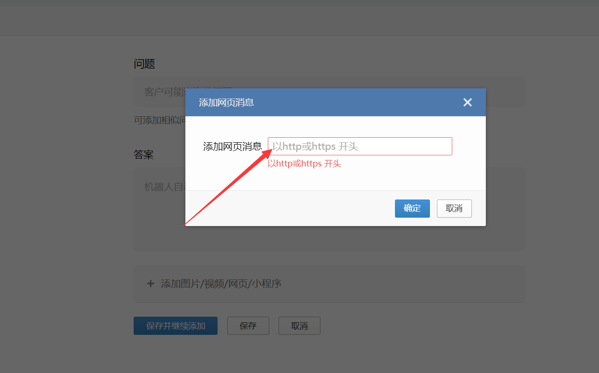
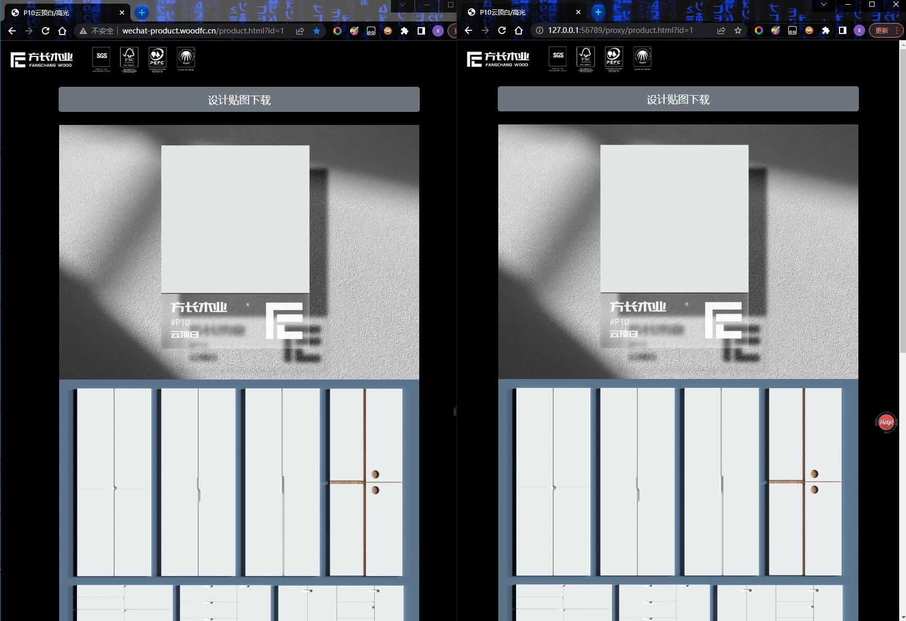
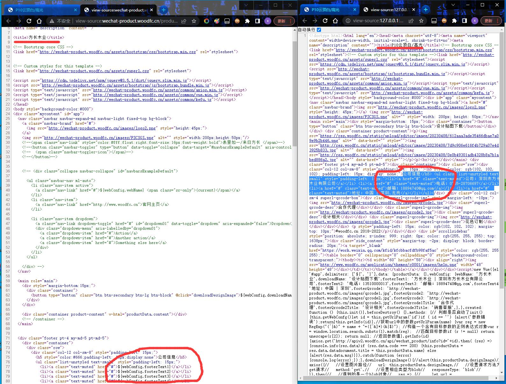

# go-prerender

## 软件简介

一款基于golang实现的前端动态渲染转静态化页面的服务软件(预渲染)，兼具反向代理功能；支持VUE/JS等页面的静态化存储，可自定义配置静态缓存过期时间。

无需改动原页面代码，没有复杂的配置，无需运行环境并且跨平台，上手即用，不懂技术的小白也可以使用；


## 为甚开发这个？

最近给朋友开发了一套前端展示系统，但是使用微信的添加网页消息后，消息卡片缺无法正常解析网页内容的标题等信息。如图：


一想肯定是微信是后台模拟HTTP数据包做请求然后对HTML源码解析的，但是我们的是使用了vue前端动态渲染，源码里面是没有数据的，数据需要经过JS处理才会显示出来。。

以前也了解过一些三方插件，如prerender-spa-plugin。但是，那是一个治标不治本的解决办法，不但需要安装三方库，还要继续搞代码，还得手工打包发布，并且数据还不方便更新。目前这种情况，比如有上百个产品，还得搞一堆配置，太麻烦了。

并且，像VUE等前端动态渲染的网页，对搜索引擎SEO也是不利的，因为搜索引擎蜘蛛也抓取不到内容！

那么怎么办呢？

有没有无需写代码就能实现该功能工具？有没有无需一大堆配置的方案？有没有不懂前端也能使用的工具？

--- 没有(当然也可能是我没找到)

所以，go-prerender应运而生。


## 主要作用

1. 动态页面加速，相当于一个独立于系统的外部辅助(实现静态化，降低服务器资源占用)；
2. 解决使用vue等前端动态渲染技术的页面，搜索引擎SEO不友好的问题；
3. 解决微信公众号或小程序引入页，却无法解析识别页面标题、描述等问题；
4. 其他...

## 运行效果
```
下图中，左侧是原网站，使用了vue.js。标题与内容都是从API获取数据后动态渲染的。而右侧是使用本软件处理过的效果，一模一样。
```


```
下图中，左侧是原网站的源码，源码中的标题是默认的，并且内容是模板标签，并不是实际的内容。而右侧是使用本软件处理过的效果，标题已经是真正的标题，HTML内容也是静态的内容(没有标签)。
```


## 优势

1. 支持跨平台运行；
2. 环境仅仅依赖chrome浏览器。无需安装软件运行环境以及无需安装其他三方库；
3. 没有复杂的配置，上手即用，不懂技术的小白也可以使用；
4. 无需修改原网站代码，类似于一个反向代理；
5. 支持静态缓存，并可指定缓存过期时间；
6. 无需配置路由，也无需手工打包生成了；


## 配置文件说明

```
system:
  logLevel: debug           # 日志等级
  baseUrl: http://www.xiao6.net   # 目标网站的跟网址
  h5: true          # 是否增加<!doctype html>前缀
  cacheTime: 86400  # 缓存时间 2592000 = 30天  604800 = 一周  -1=永久缓存  0=不缓存  单位为秒

browser:
  show: 0              # 是否显示浏览器     
  timeout: 10          # 请求超时时间

httpServ:
  ip: 127.0.0.1         # HTTP服务绑定的IP地址，如果需要远程访问，则改为外网IP，并开启对应的防火墙端口例外
  port: 56789           # HTTP服务端口
```

## 使用说明

```
比如，原本使用vue等构建的网站访问地址为：http://www.xiao6.net/

1： 把原地址域名改为old.xiao6.net
2:  nginx新建网站，绑定域名为www.xiao6.net，设置反向代理地址为本程序的访问地址。


#PROXY-START/

location ^~ /
{
    proxy_pass http://127.0.0.1:56777;
    proxy_set_header Host $host;
    proxy_set_header X-Real-IP $remote_addr;
    proxy_set_header X-Forwarded-For $proxy_add_x_forwarded_for;
    proxy_set_header REMOTE-HOST $remote_addr;
    proxy_set_header Upgrade $http_upgrade;
    proxy_set_header Connection $connection_upgrade;
    proxy_http_version 1.1;
    # proxy_hide_header Upgrade;

    add_header X-Cache $upstream_cache_status;

    #Set Nginx Cache
    
    
    set $static_filek737nQap 0;
    if ( $uri ~* "\.(gif|png|jpg|css|js|woff|woff2)$" )
    {
    	set $static_filek737nQap 1;
    	expires 1m;
        }
    if ( $static_filek737nQap = 0 )
    {
    add_header Cache-Control no-cache;
    }
}

#PROXY-END/
```

每个页面的第一次访问会慢一些，但会自动生成缓存，第二次则很快。

## 其他

本系统已经开源，如对您有帮助，请Watch、Star项目，同时也是对项目最好的支持.

软件写的比较匆忙，并且也是第一个版本，还有些想法暂未实现，后面根据star次数会抽空维护。

```
联系QQ: 86717375 (superl)
忘忧草安全3群(QQ群)： 235586182
Network Security Group（Telegram）: https://t.me/sec_nst
```

